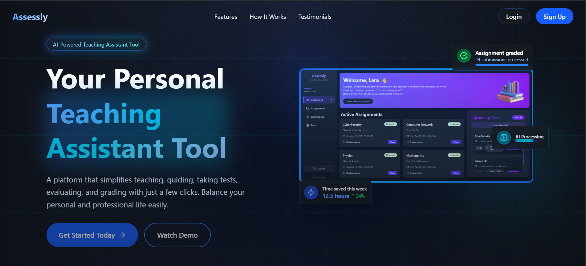

# Assessly -  AI-Powered Teaching Assistant Tool for Educators

**Developed for Hack4Bengal Hackathon**

[](https://opensource.org/licenses/MIT)

**Assessly is an AI-powered platform designed to be a teacher's go-to personal assistant. It provides tools to simplify teaching, guiding, evaluating, and grading, empowering educators to reclaim valuable time and strike a better work-life balance.**

---

## Live Demo & Preview

Experience Assessly live: **[https://assessly-h4b.vercel.app/](https://assessly-h4b.vercel.app/)**



---

## The Problem We Solve

Teachers in schools, coaching centres, and colleges often face an overwhelming workload, particularly when it comes to providing individualized feedback to students in large classrooms. The manual processes of grading assignments and creating tests are incredibly time-consuming, leaving educators with limited bandwidth to focus on actual teaching, mentoring, and personalized student interaction.

This challenge is especially acute in under-resourced educational settings where high teacher-to-student ratios are common. Consequently, students often miss out on the personalized guidance and timely feedback crucial for their academic development and success. This administrative burden contributes significantly to teacher burnout and impacts the quality of education.

---

## Our Solution: Assessly

Assessly tackles these challenges head-on by offering a platform that leverages AI to automate and streamline key pedagogical tasks.

Our core functionalities include:

1.  **Automated Assignment & Test Grading:** Utilizing AI (powered by Gemini API), Assessly can evaluate student submissions, including **handwritten answers** processed via Optical Character Recognition (OCR). It provides instantaneous grading and personalized, constructive feedback for each student.
2.  **Automated Test Generation:** Teachers can generate customized online tests quickly based on specified topics or subjects, again with support for questions that might involve OCR for answer evaluation later.

By automating these intensive tasks, Assessly frees up teachers to focus on what they do best: teaching, mentoring, and fostering student growth.

---

## Key Features

*   **AI-Powered Evaluation:** Automated grading and feedback for assignments and tests using advanced AI models.
*   **OCR Support:** Seamlessly processes and evaluates handwritten answers, bridging the gap between traditional methods and digital efficiency.
*   **AI-Powered Test Generation:** Quickly create diverse and relevant online tests with just a few clicks.
*   **Bring Your Own API Key:** Teachers can optionally add their own Google Gemini API keys to leverage higher usage limits or premium features. Keys are stored securely in our database.
*   **Centralized Dashboard:** Manage assignments, tests, submissions, and results all in one place.
*   **Reduce Workload:** Significantly cuts down on administrative time, helping teachers balance professional and personal life.

---

## Tech Stack

*   **Frontend:** React, TypeScript, Tailwind CSS, Framer Motion
*   **Backend:** Node.js, Express.js, TypeScript
*   **Database:** MongoDB
*   **AI Integration:** Google Gemini API
*   **File Storage:** Vercel Blob (for handling uploads like handwritten submissions)
*   **Deployment:** Vercel

---

## IMPACT (Hack4Bengal Focus)

*   **Efficiency & Productivity:** Directly addresses teacher workload, saving hours spent on manual grading and test creation.
*   **Enhanced Learning:** Provides students with faster, more consistent, and personalized feedback, crucial for academic improvement.
*   **Scalability:** Offers a solution applicable across various educational levels (schools, colleges, coaching centers).
*   **Accessibility:** OCR feature makes AI evaluation accessible even for non-digitally submitted handwritten work.
*   **Innovation:** Leverages cutting-edge AI (Gemini) and cloud technologies to solve a persistent problem in education.

---

## Project Structure

(Root directory `thebotheads-assessly/` contains `README.md` and `LICENSE`)

### Client (Frontend)

```
Client/
├── README.md
├── eslint.config.js
├── index.html
├── package-lock.json
├── package.json
├── tsconfig.app.json
├── tsconfig.json
├── tsconfig.node.json
├── vercel.json
├── vite.config.ts
├── .gitignore
├── public/
└── src/
    ├── App.tsx
    ├── Global.css
    ├── main.tsx
    ├── vite-env.d.ts
    ├── assets/
    ├── Components/
    │   ├── AssignmentCard.tsx
    │   ├── Assignments.tsx
    │   ├── AssignmentSection.tsx
    │   ├── CreateAssignments.tsx
    │   ├── Dashboard.tsx
    │   ├── ExportButton.tsx
    │   ├── ExportButtonTest.tsx
    │   ├── GenerateTest.tsx
    │   ├── GeneratorModal.tsx
    │   ├── Input.tsx
    │   ├── Results.tsx
    │   ├── Sidebar.tsx
    │   ├── SidebarItem.tsx
    │   ├── Submissions.tsx
    │   ├── TestQuestions.tsx
    │   └── Tests.tsx
    ├── Context API/
    │   └── StateContext.tsx
    └── pages/
        ├── ErrorRoute.tsx
        ├── Home.tsx
        ├── LandingPage.css
        ├── LandingPage.tsx
        ├── Login.tsx
        ├── Signup.tsx
        └── StudentSubmission.tsx
```

### Server (Backend)

```
Server/
├── package-lock.json
├── package.json
├── tsconfig.json
├── tsconfig.tsbuildinfo
├── vercel.json
├── .gitignore
└── src/
    ├── index.ts
    ├── Config/
    │   └── config.ts
    ├── Middleware/
    │   └── middleware.ts
    ├── Routes/
    │   ├── assignment.routes.ts
    │   ├── auth.routes.ts
    │   ├── submission.routes.ts
    │   ├── test.route.ts
    │   └── user.routes.ts
    ├── Schema/
    │   └── db.ts
    └── utils/
        └── utils.ts
```

---

## Getting Started (Local Development)

**Prerequisites:**
*   Node.js and npm/yarn installed
*   MongoDB instance (local or cloud like MongoDB Atlas)
*   Google Gemini API Key

**Backend Setup:**

1.  Navigate to the `Server` directory: `cd Server`
2.  Install dependencies: `npm install` or `yarn install`
3.  Create a `.env` file in the `Server` directory and add your environment variables (e.g., `MONGODB_URI`, `GEMINI_API_KEY`, `JWT_SECRET`, `PORT`). Refer to `Server/src/Config/config.ts` potentially for required variables.
4.  Compile TypeScript: `npm run build` or `yarn build`
5.  Start the server: `npm start` or `yarn start` (or use `npm run dev`/`yarn dev` for development mode if configured)

**Frontend Setup:**

1.  Navigate to the `Client` directory: `cd ../Client`
2.  Install dependencies: `npm install` or `yarn install`
3.  Create a `.env` file in the `Client` directory if needed for environment variables (e.g., `VITE_API_BASE_URL` pointing to your backend server).
4.  Start the development server: `npm run dev` or `yarn dev`
5.  Open your browser and navigate to `http://localhost:5173` (or the port specified by Vite).

---

## Future Scope

We envision Assessly evolving further to become an indispensable tool for educators:

*   **Scalability:** Enhance infrastructure to support a larger user base and concurrent operations.
*   **Data Security:** Implement more robust data security and privacy measures.
*   **LMS Integration:** Develop compatibility and integration with popular Learning Management Systems like Canvas, Blackboard, Moodle, and Google Classroom.
*   **API for Data Exchange:** Provide an API to allow seamless data exchange and grade synchronization between Assessly and other educational platforms.
*   **Advanced Analytics:** Offer deeper insights into student performance and learning patterns.

---

## License

This project is licensed under the MIT License - see the [LICENSE](LICENSE) file for details.

---

Made by **TheBotHeads** for Hack4Bengal.
